

# Installing an Extension

One of the strengths of openHAB is that new capabilities can easily be added by installing extensions. These capabilities can be a technology (like Z-Wave, Philips HUE, Sonos, ...), user interfaces, database connections and others.

Especially at the beginning of an openHAB installation one of the most common activities is to include existing home automation technologies. Therefore we use a **binding** to learn how to add extensions.

The workflow for adding a binding normally consists of three steps:

1. [Add new binding](#add-new-binding)
2. [Scan for new things](#scan-for-new-things)
3. [Configure things](#configure-things)


## Prerequisites

* Access to the [PaperUI](uis.html/#the-paper-ui)


## Add New Binding

| 1. |  ```http://192.168.20.3:8080/start/index```   | Point your browser to the PaperUI. Please adjust the IP adress to that of your openHab server. |
| 2. | 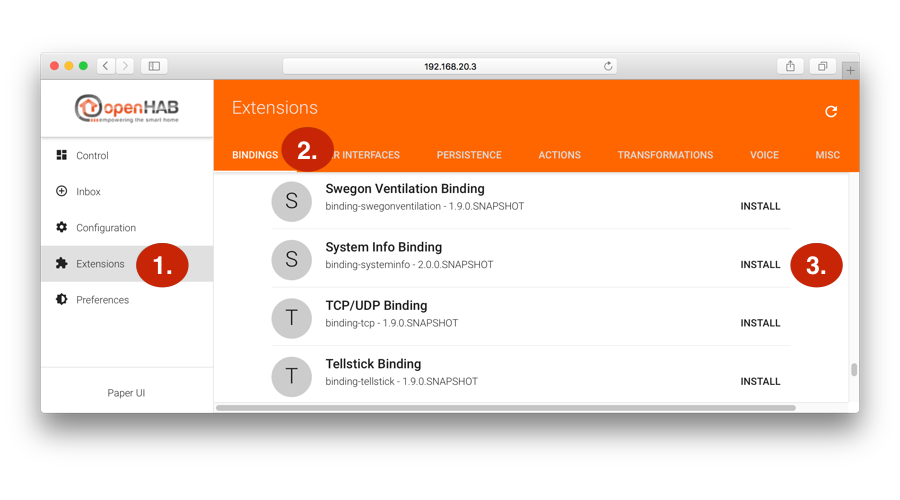    | 1. Click in the left hand menu to the item **Extension** <BR> 2. Ensure that the tab **Bindings** is selected  <BR> 3. Scroll down to the entry **System Info Binding** and press **Install** on the right hand side    |
| 3. |   | Once the extension is installed, the extension's symbol is marked as active. |


## Scan For New Things

Now the functionality offered by the newly installed binding can be added. For the Network Info Binding this happens by starting an auto-discovery scan and will result in one new thing. A [thing](http://docs.openhab.org/concepts/things.html) is the logical representation of a physical entity, in this case your openHAB server.

| 4. | 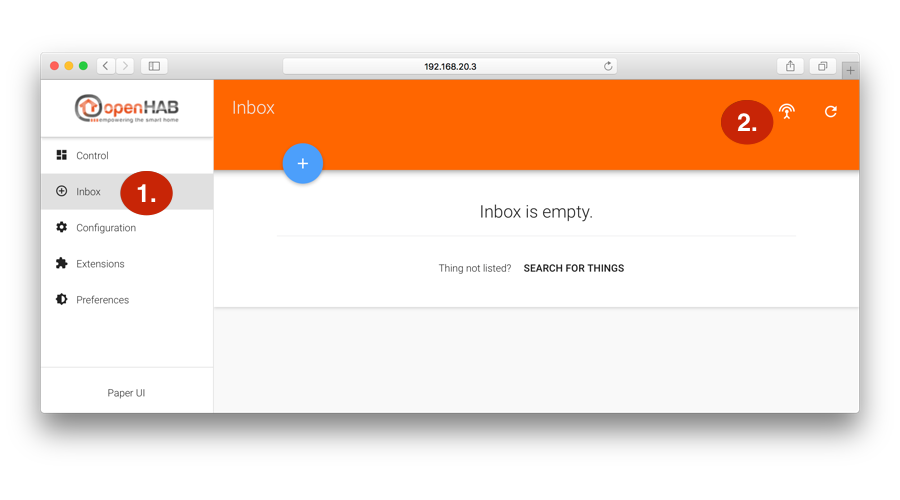 | 1. In the left hand menu select the item **Inbox** <BR> 2. Click on the **Scan** icon in the upper right corner <BR> |
| 5. | 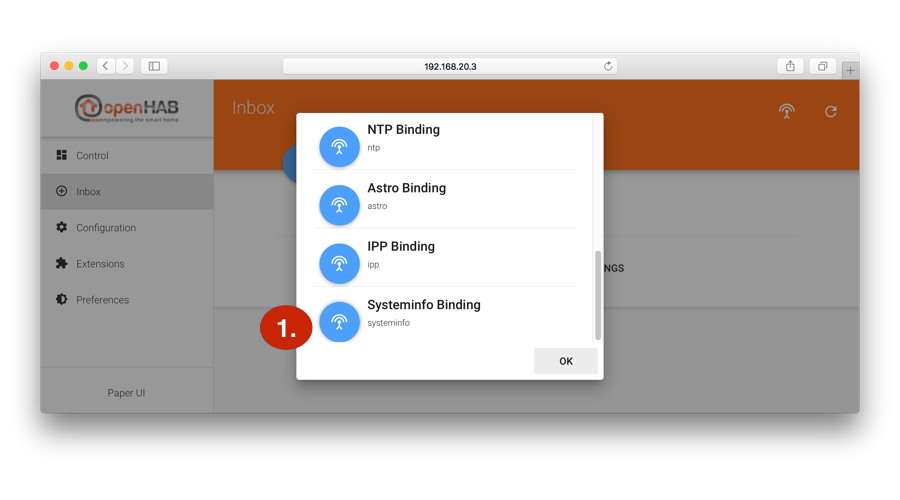 | In the now opening pop-up scroll down and click on   in order to start the scan process for the **System Info Binding** |
| 6. | 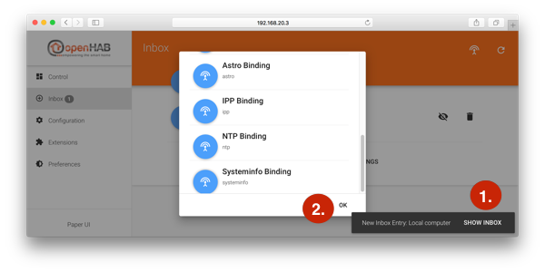 | 1. The scan process will announce any newly found things via a small message box on the lower right hand side.  As there is only one server to discover, you can directly click the message box to jump to the inbox. <BR> 2. Alternatively you can click on **OK**. |
| 7. | 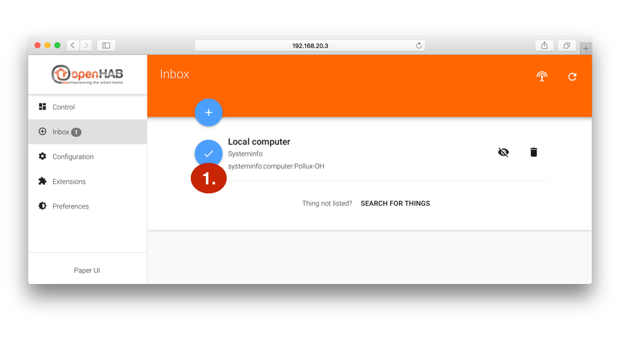 |  As a result you will now find one new thing in the inbox. Now click on the add symbol . |
| 8. | 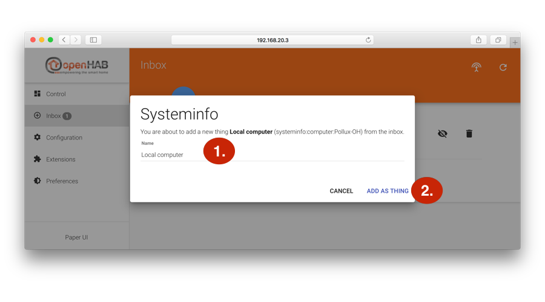 | In the pop-up: <BR> 1. Leave the default name "Local computer" <BR> 2. click "ADD AS THING"  |
| 9. | 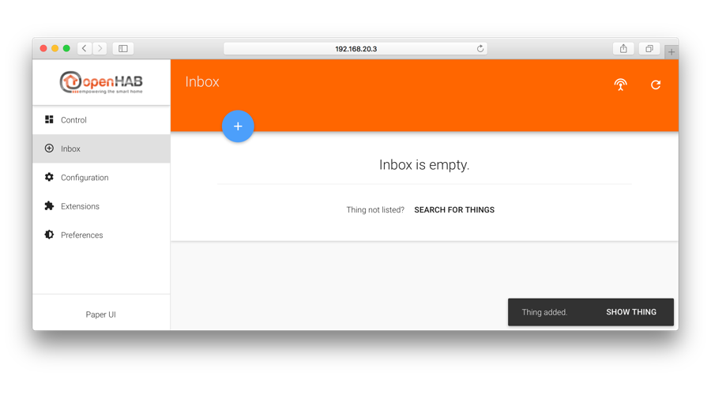 | Now the system info thing is added to your installation and has therefore moved out of the inbox. |

## Configure Things

| 10. | 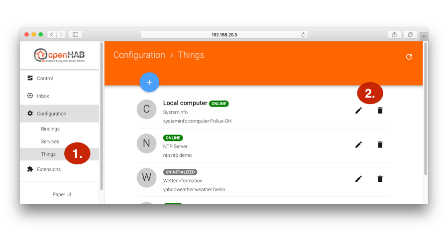 | 1. Click in the left hand menu to the item **Configuration** and then **Things**. You will see a list of the existing things. <BR> 2. Look for the item "Local computer" and press the  edit symbol.   |
| 11. | 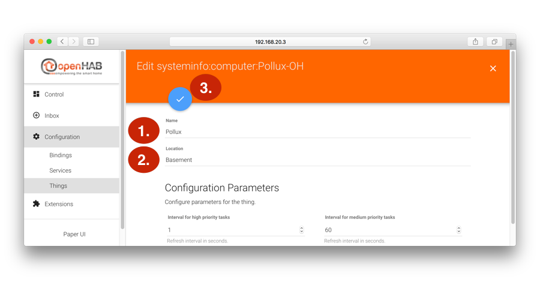 | 1. Enter the computer's name on which the openHAB instance is running (here: Pollux) <BR> 2. Enter the location (here: Basement) <BR> 3. Click the  Save button. |
| 12. | 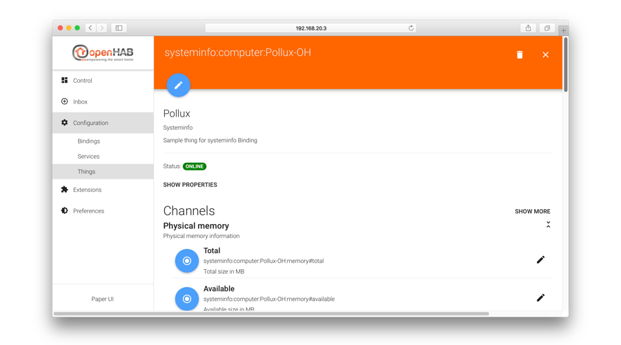 | As a result the overview of the thing you just created is shown. Please ensure that the status is . |
| 13. | 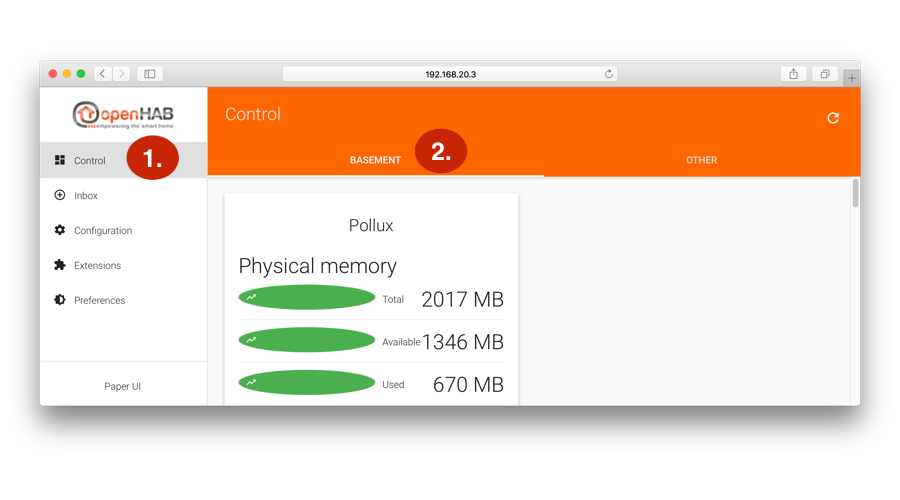 | To see the different information provided by the PaperUI, <BR> 1. navigate to the Controll page of the PaperUI. <BR> 2. There you will see a tab (2.) with the location you entered in stetp 13 (here: Basement). On this tab the thing representing your openHAB server displays various information from the System Info binding. |


## Related Information

* [Concepts of Things](http://docs.openhab.org/concepts/things.html)
* [Discovery of Things](http://docs.openhab.org/concepts/discovery.html)
